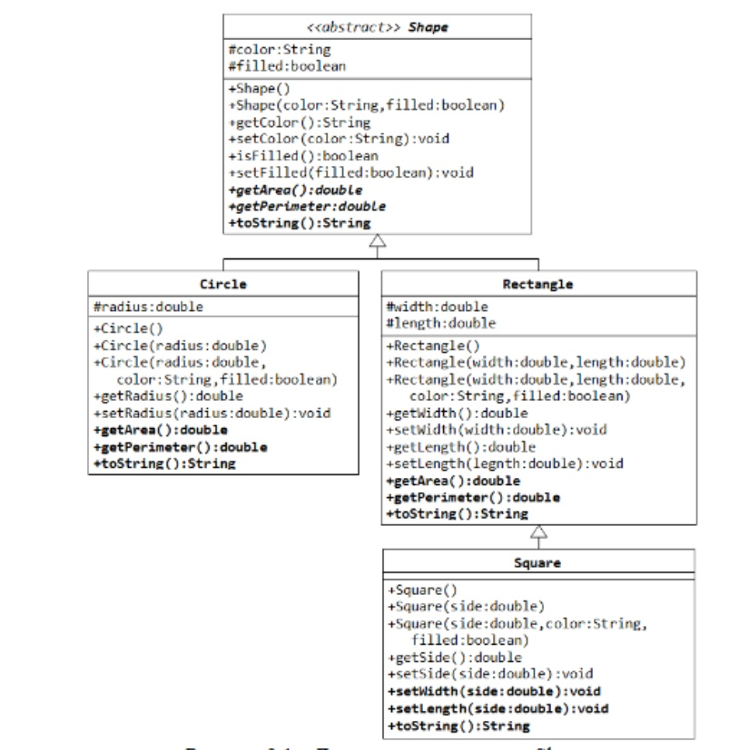

# Задание к Практической №8

1. Создать абстрактный класс, описывающий мебель. С помощью наследования реализовать различные виды мебели. Реализовать класс магазина мебели (FurnitureShop), реализовать каталог мебели, с возможность покупки. Создать консольный интерфейс.
2. Воссоздать классы из UML диаграммы .

